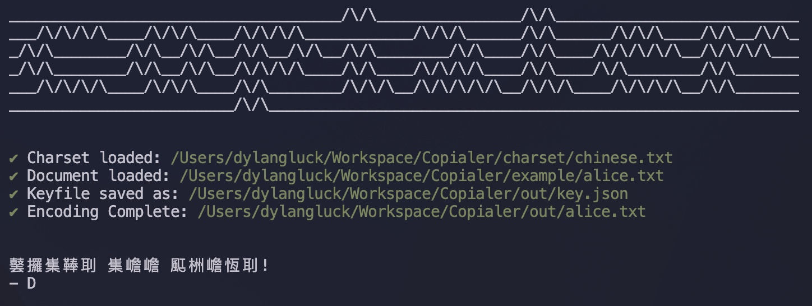

# Copialer

Tool to encode and decode text using copiale cipher. Inspired by [this video](https://www.youtube.com/watch?v=CVHVZjaXzH8&t=3s) on the [this cipher](https://cl.lingfil.uu.se/~bea/copiale/). 

## Main Functions

- [x] Generate cypher key file
- [x] Encode text using key
  - [x] Read from txt file
  - [x] Output to txt file
  - [ ] Read from STDIN
  - [ ] Output to STDOUT
- [ ] Decode text using key
  - [ ] Read from txt file
  - [ ] Output to txt file
  - [ ] Read from STDIN
  - [ ] Output to STDOUT

## TODO:

- [ ] Input argument flags for settings
- [ ] STDOUT interface & prompt
- [x] Cipher Logic
- [x] Get base charset
- [x] Create first keyfile

## Notes:

- Need better charset files, using the full set returns too many <?>. Using the chinese set is cool but limited.
- Need to find a way to replace the letter with *one of the replacements for each instance* not the same replacement across the whole document.
- Ideas for cli options
  - Flag for interactive mode
  - Flag to encode or decode
    - Require keyfile for decode (Not a cracking tool lol)
  - Flag to only generate keys
  - Flag for charset (used to create keyfile)
  - Flag for keyfile
    - If no keyfile, generate one on encode
  - Flag for input-file
    - Default to STDIN
  - Flag for output-file
    - Default to STDOUT
- Update naming, right now its very confusing. Start on paper, draw it out lol
- Refactor code. Does it even need to have async calls?? I dont think so.

## Sources

- https://github.com/bits/UTF-8-Unicode-Test-Documents
- https://gist.github.com/phillipj/4944029
